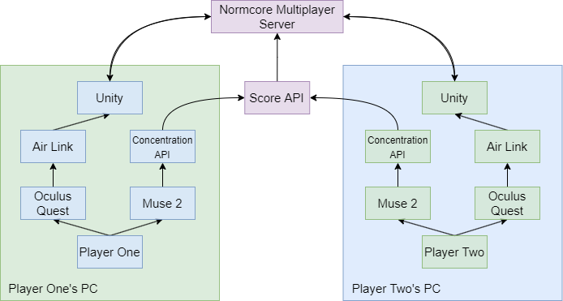

# BrainBlast-NatHacks2022
Brain Blast is a two-player Virtual Reality battle game. Each player controls a laser beam that's strength comes from their EEG-measured concentration levels. If you can out-focus your opponent, an explosive victory is awaiting you. Do you have what it takes to blast away the competition?

 <br> 

# How it works


This game requires: 

* 2 x Oculus Quest (running on a PC using AirLink)
* 2 x Muse EEG headband
* [Python Muse API](MuseAPIs)
* [BrainBlast.exe](BrainBlastUnityProject) (Unity Game)

To run the APIs:
Concentration API for player 1 on PC One:<br>
```python -m uvicorn concentration:app --reload --host [YOUR IP HERE] --port 8000```<br>
Concentration API for player 2 on PC Two:<br>
```python -m uvicorn concentration:app --reload --host [YOUR IP HERE] --port 8001```<br>
Score API (only runs on one of the PC's): <br>
```python -m uvicorn main:app --reload --host [YOUR IP HERE] --port 8002```<br>

